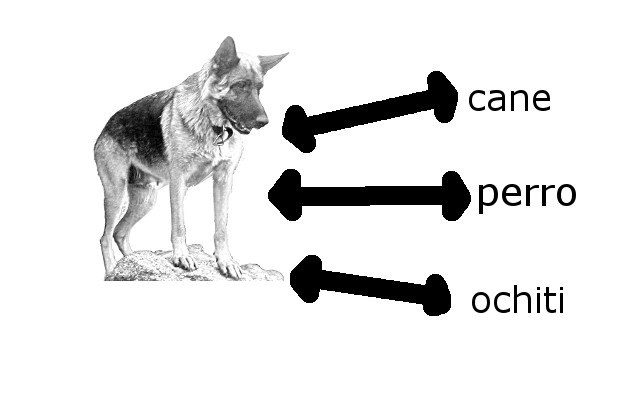

# Introducción y objetivos

Vamos a presentar dos maneras de ver el lenguaje: como un objeto social, colectivo y como un objeto individual cognitivo. Veremos que el lenguaje tiene distintas propiedades según la perspectiva que se adopte. 

Objetivos: 

-Entender la diferencia entre el lenguaje como objeto social y como capacidad cognitiva individual

-Entender las diferencias entre el lenguaje humano y el lenguaje animal

-Entender el papel esencial del lenguaje humano en la vida diaria, y en la manera de pensar de los seres humanos

---
class: center, middle, inverse

# Lenguaje humano y lenguaje animal

---
# El estudio del lenguaje

- Todos los niños que nacen sin dificultades cognitivas y que son expuestos al estímulo lingüístico desarrollan la capacidad de entender y hablar una o más lenguas de manera más o menos similar. 

   - unos de los pocos "derechos" que todos los humanos tenemos garantizados al nacer
   
   - es una capacidad que en cierta manera nos define como seres humanos
  
    - nos permite transmitir conocimientos a larga distancia, expresar nuestro estado de ánimo, crear historias, etc. 
    
---
class: middle, center

# ¿Cómo es esto posible?

--

#### el lenguaje se basa en una **capacidad cognitiva**

---
class: center, middle
# Comparamos el lenguaje humano con el de los animales 

<iframe width="560" height="315" src="https://www.youtube.com/embed/_1FY5kL_zXU" title="YouTube video player" frameborder="0" allow="accelerometer; autoplay; clipboard-write; encrypted-media; gyroscope; picture-in-picture" allowfullscreen></iframe>

---
# Hay cuatro propiedades descritas

- Las unidades separables

- La gramática

- La productividad 

- La abstracción

---
# Unidades separables

Ayer fui a una fiesta y conocí a una persona

Ayer fui a una fiesta y reconocí a una persona

- la unidad de *re-* cambia el significado del verbo

---
# Gramática

- Las reglas que regulan cómo se combinan las unidades del lenguaje

.pull-left[

La casa morada
]

.pull-right[

El casa morado
]

¿Por qué no funciona *el casa morado* en español?

---
# Productividad

- La capacidad de producir mensajes potencialmente infinitos con medios limitados

*La casa que está en la esquina que está en la ciudad que está en el centro del país que queda en el continente que está en el hemisferio sur... es morada*

--

Aquí hemos ido acumulando una frase después de otra usando el mismo mecanismo gramatical repetido (en este caso una cláusula de relativo)

---
# Abstracción

- La capacidad de expresar pensamientos sobre situaciones que no están en el entorno inmediate del hablante

*En esa historia, había un elefante que no sabía volar, pero que aprendió*

En este caso, estoy expresando una idea sobre algo imaginario que ha "ocurrido" en el pasado. 

---
# Comparamos el lenguaje humano con el de los animales 

La comparación del lenguaje humano y el lenguaje de los animales nos muestra que hay diferencias importantes: algunos lenguajes animales tienen algunas de las características  de los lenguajes humanos, pero no parece que ninguna reúna todas esa posibilidades

---
# Comparamos el lenguaje humano con el de los animales 

- TAL VEZ la diferencia entre los lenguajes humanos y los animales es de grado, pero al mismo tiempo, es la suma acumulativa de todas esas propiedades la que le da un caracter cualitativamente distinto al lengauje humano que al lenguaje animal 

---
class: center, middle

<iframe width="560" height="315" src="https://www.youtube.com/embed/4udl87_OzJA" title="YouTube video player" frameborder="0" allow="accelerometer; autoplay; clipboard-write; encrypted-media; gyroscope; picture-in-picture" allowfullscreen></iframe>

---
# Lengua y lenguajes

- Si alguien habla de una lengua, se refiere a **lo que hablan un conjunto de personas en una región o en un país**

--

- Nosotros hablamos el inglés de NJ/de los EE.UU/de XX

---

---
# Dialectos

- Pequeñas variaciones entre regiones o entre hablantes

- Por ejemplo, el español salvadoreño se ve como una variedad regional parte de otra variedad más amplia (el "idioma español" en la definición). 

- Por eso decimos que el español cubano (o caribeño) es un poco distinto del español de Chile o de España. 

- **Es importante tender que este concepto se refiere a la lengua como un objeto social y colectivo (hablado por varios hablantes), que puede cambiar. Por ejemplo, antes de la llegada de los españoles a América, no se hablaba español, pero ahora sí se habla.**

---
# Lengua como objeto social e histórico

- delimitada a un momento histórico

- delimitada geográficamente

- hablada por grupos de hablantes

---
class: center, middle, inverse

# La lengua como capacidad cognitiva

---
class: center, middle

# El lenguaje es una capacidad cognitiva individual de los seres humanos

--

Desde esta perspectiva, el estudio del lenguaje es el estudio de habilidades individuales que dependen de nuestra capacidad cognitiva, y no importa tanto si la lengua se habla en un país o si dos variedades son la misma lengua o distintas lenguas. 

---
# Componentes básicos del lenguaje (como capacidad indivudal, cognitiva)

- las lenguas emparejan un significante y un significado

---
# Componentes básicos del lenguaje (como capacidad indivudal, cognitiva)

- La asociación entre el sonido/gesto y el concepto es **arbitraria** 

- no hay ninguna propiedad del concepto que determine la forma del sonido/gesto (por eso el sonido cambia de lengua a lengua).

---
class: center, middle 

Además de la idea social del lenguaje, podemos ver el lenguaje como una capacidad individual, fundamental en los seres humanos. 

Si la miramos desde un punto de vista suficientemente abstracto, vemos que las distintas lenguas tienen propiedades muy parecidas (como los ojos), y que la variación solo ocurre en ciertos aspectos muy específicos (qué sonidos tiene una lengua pero no la otra, el nombre que se le da a los objetos, etc., igual que el color de los ojos). Esta noción de lengua como capacidad cognitiva, es la que adoptamos en este curso.

 
--
 

El lenguaje es una capacidad cognitiva individual, presente en todos los seres humanos. Algunos aspectos son comunes para todos los seres humanos, y con otros aspectos producen variaciones limitadas

---
# El lenguaje dentro de las ciencias cognitivas

- Si el lenguaje es una capacidad cognitiva individual, su estudio se conecta con el estudio de otras capacidades cognitivas, como la visión, la audición, la orientación espacial, etc.

- Un ejemplo de la importancia de esta nueva perspectiva se puede encontrar en la adquisición del lenguaje. 

---
# El estudio de las partes del lenguaje

- La fonología 

- La sintaxis

- La morfología 

- La semántica

- La pragmática 

---
# Resumen: 

- Podemos ver el lenguaje como un sistema de comunicación producto de un momento histórico, usado por un grupo coletivo, y hablado en una región geográfica

  - también como una capacidad cognitiva individual de todos los seres humanos 
  
- La capacidad cognitiva del lenguaje incluye aspectos de la forma de los enunciados (los sonidos o los gestos), cómo se combinan las partes del lenguaje (la sintaxis), cómo se asocian esas palabras y frases con significados (la semántica), cómo se estructura la información lingüística (la pragmática) y cómo se adquieren las lenguas.
