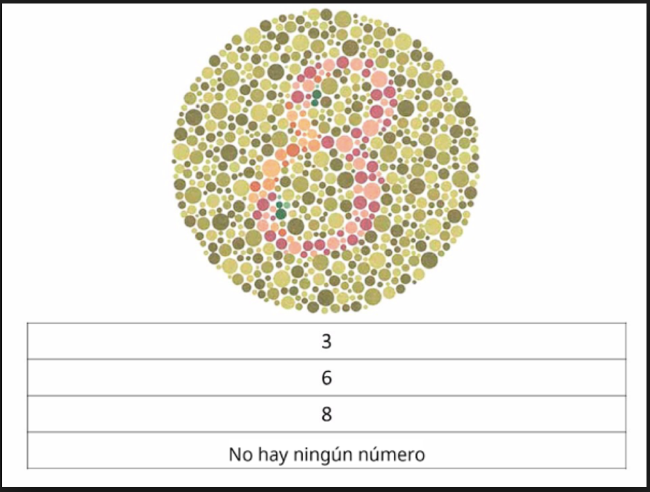
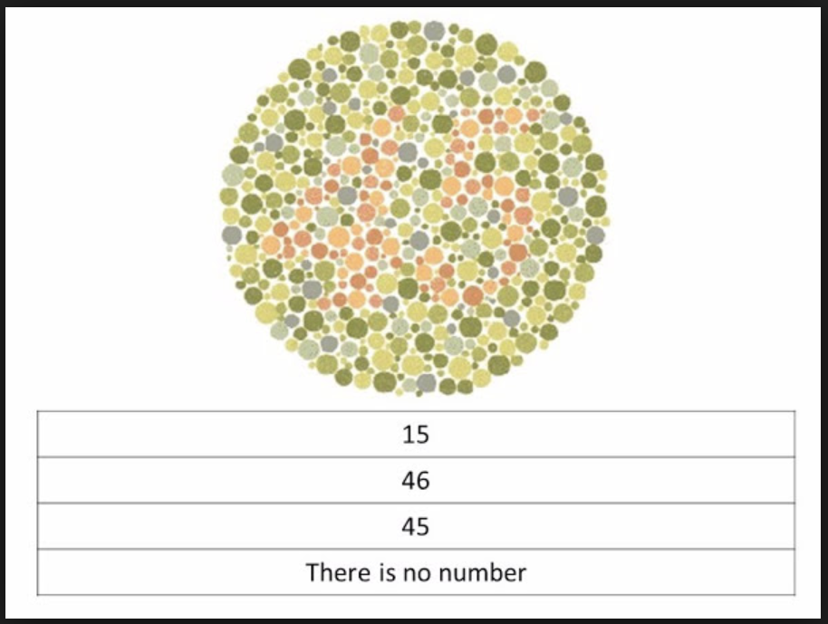
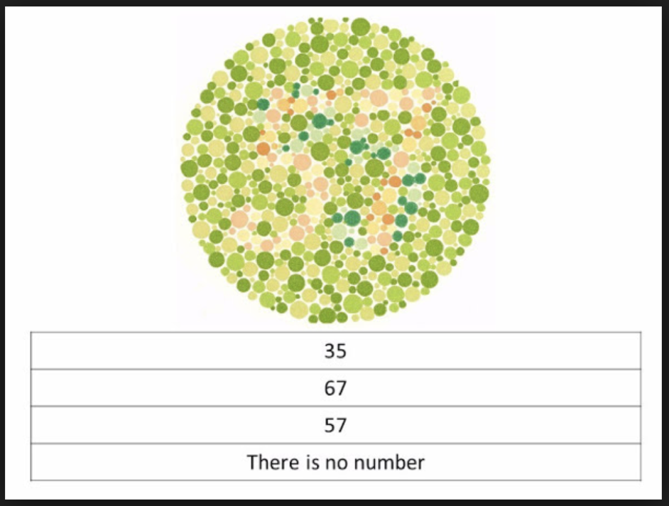
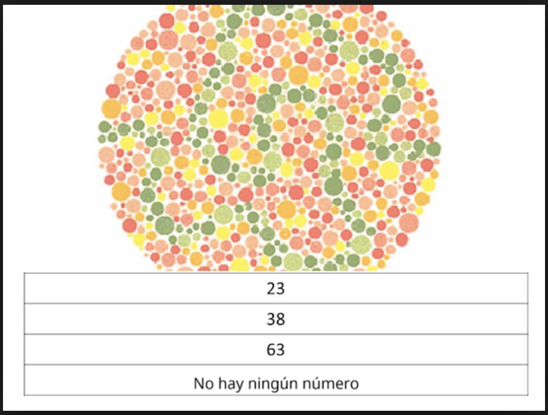
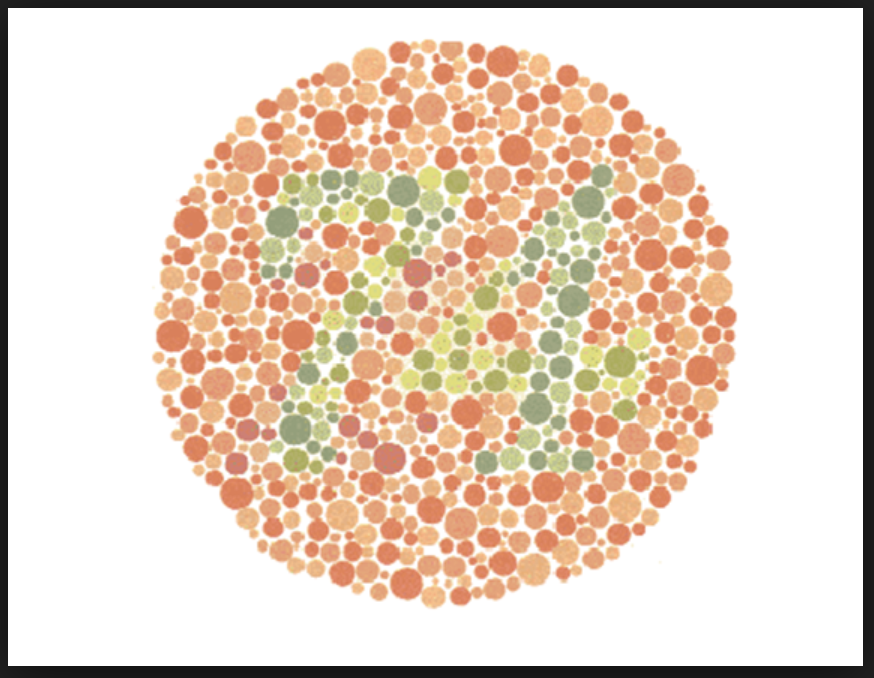
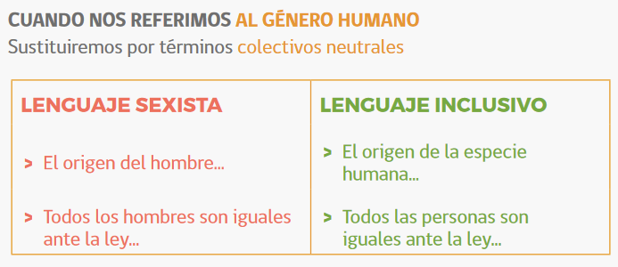
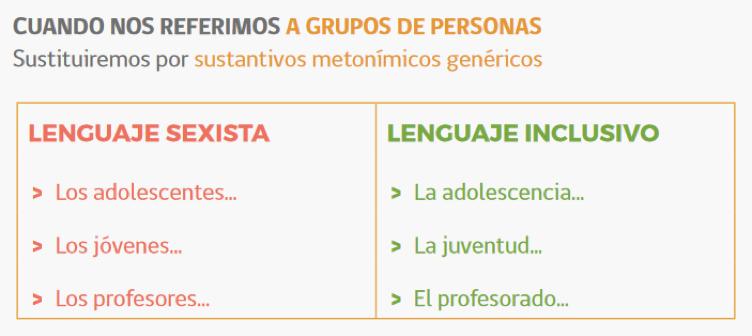

# Introducción y objetivos

En esta sección, presentamos una distinción importante entre dos sistemas de reglas: los sistemas prescriptivos/normativos y los sistemas auto-organizados. Esta distinción es importante para entender dos perspectivas distintas sobre el lenguaje, y cómo funcionan sus reglas

Objetivos: 

-Entender la diferencia entre sistemas prescriptivos/normativos y sistemas auto-organizados

-Entender qué aspectos del lenguaje son prescriptivos/normativos y cuáles son auto-organizados

---
class: center, middle, inverse

# Sistemas prescriptivos/normativos y auto-organizados

---
class: center, middle

# Pregunta del día

Si podrías viajar a cualquier parte del mundo, ¿dónde irías y por qué?

---
# Warm-up

Lee la descripción, decide si es un sistema auto-organizado o uno normativo:

.pull-left[
- estas reglas tratan de regular el comportamiento humano

- son convencionales, cambiables, y han sido definidas por personas externas
]

.pull-right[
- estas reglas son internas a los sistemas: no las determina un grupo externo

- existen independientemente de que los seres humanos describamos sus reglas
]

---
# Características se asocian con los sistemas de reglas normativos y auto-organizados

.pull-left[
**Sistema normativo**

- como **debería** ser el sistema que se regula

- reglas **convencionales y cambiables**

- hay **responsables externos** que regula es sistema

- los responsables externos pueden ser un **grupo definido** (el senado, por ejemplo), o un grupo social no muy definido
]

.pull-right[
**sistema auto-organizado**

- como **es** un sistema

- no cambian fácilmente y no son convencionales

- no hay responsables externos que regulan el sistema

- puede haber personas que **describen** cómo funciona el sistema
]

---
# sistema normativo vs sistema auto-organizado

- Veamos estos ejemplos...

---
# Una prueba de visión

- en esta prueba, se trata de distinguir un número

---
class: center

---
class: center

---
class: center

---
class: center

---
class: center

---
# La visión

- El sistema de visión tiene dos partes:

--

.pull-left[

- neuronas que captan impulsos de longitud de onda

]

.pull-right[

- un sistema mental que "interpreta" esos impulsos como colores

]

---
# El lenguaje humano

- "Normas del español actual"

- "Uso de las mayúsculas"

- "Cómo y cuando usar dentro y adentro"

- "¿Debemos decir de 2002 o del 2002?"

- "Recomendaciones de la Real Academia"

---
# Aspectos normativos del lenguaje humano

---
# Aspectos normativos del lenguaje humano

---
# Aspectos auto-organizados del lenguaje humano

- El lenguaje humano oral tiene vocales y consonantes

- Los sonidos de las lenguas se organizan en sílabas 

- Las palabras se combinan para formar unidades más grandes (la casa *azul*)

---
# El lenguaje humano

- Al mismo tiempo, es un sistema normativo y un sistema auto-organizado:

  - Como sistema normativo, tiene reglas decidas por un grupo externo, que pueden cambiar, y que son convencionales

  - Como sistema auto-organizado, tiene reglas internas que se pueden describir/descubrir, y que no dependen de un grupo externo
  
---
# Características normativas y auto-organizadas del lenguaje

.pull-left[
- el objetivo del punto de vista normativo del lenguaje es enseñar a escribir y hablar **correctamente**
]

.pull-right[
-el objetivo desde el punto de vista de "auto-organización" es entender cómo funciona el lenguaje (describir su organización a distintos niveles)
]

---
# ¿Normativo o auto-organizado?

.pull-left[
### **Sistema normativo**

- prioridad de la lengua **escrita**
]

.pull-right[
### **Sistema auto-organizado**

- prioridad de la lengua **hablada**
]

---
class: middle, center

# Kahoot

https://create.kahoot.it/k/96b00550-12c9-467f-984e-b88bcbf02548  
