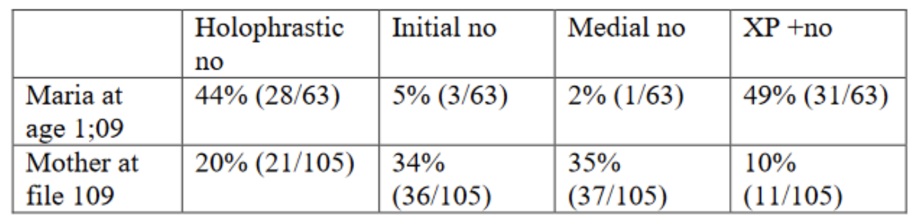
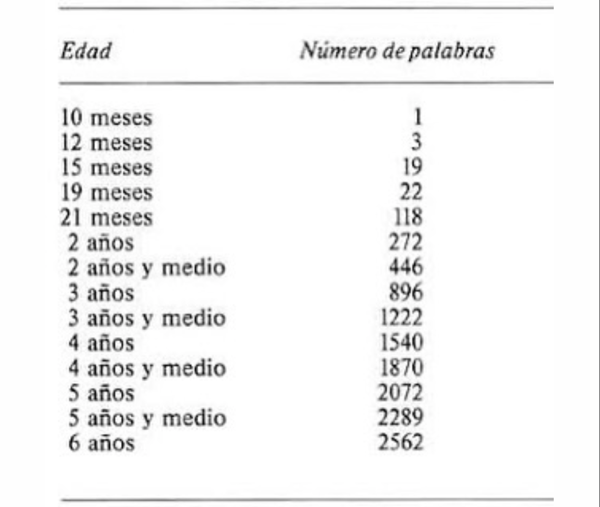
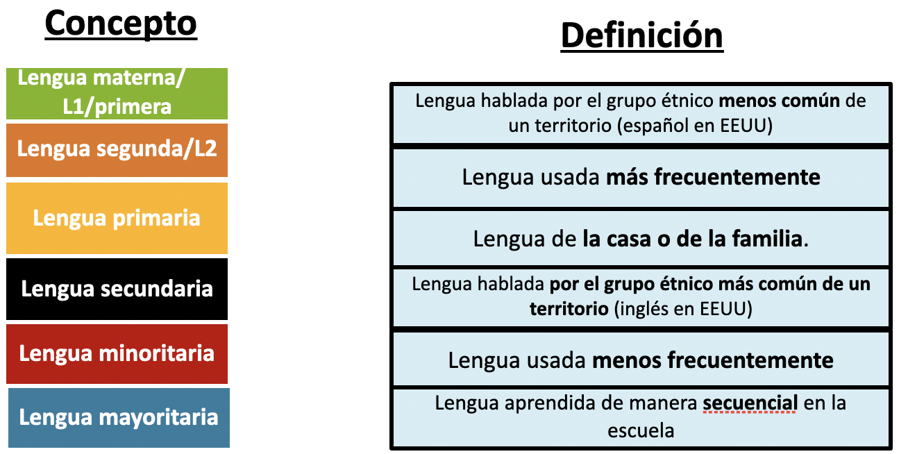
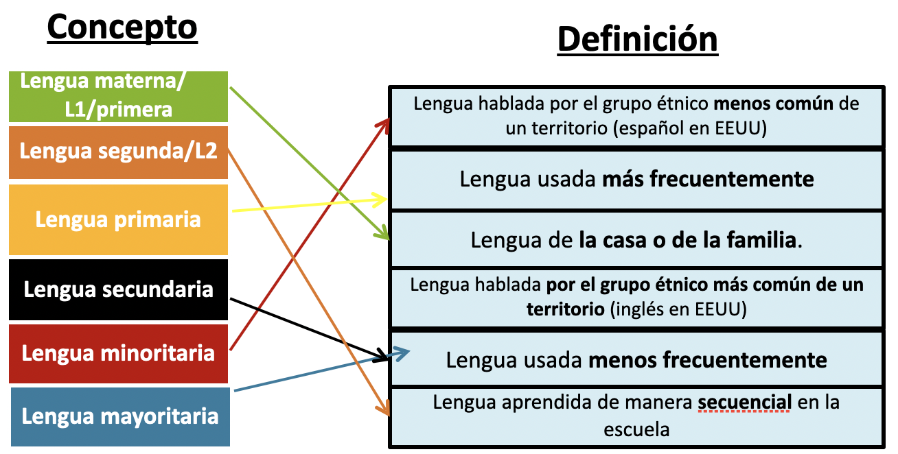
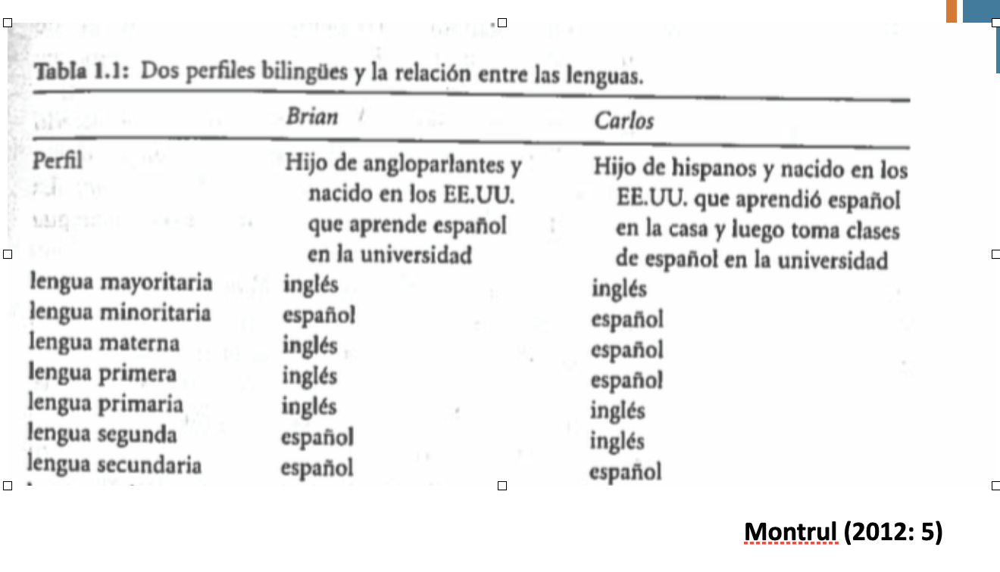

class: center, middle, inverse

# Cómo se aprenden las lenguas

---
class: center, middle

# ¿Qué es la adquisición?

--

## ¿y el aprendizaje?

---
# Algunos aspectos de la adquisición:

- El lenguaje es complejo

--

- La adquisición es relativamente rápida

--

- Hay etapas comunes para todos los niños

--

- El lenguaje no se aprende por imitación directa, pero la exposición al estímulo es esencial 

---

insert video here

---

insert video here

---
# El lenguaje es complejo 

insert video here

---
# El lenguaje es complejo y se adquiere relativamente rápido

- Tratemos de dibujar la siguiente idea:

  - No creo que mañana llueva
  
--

- El lenguaje puede expresar idea abstractas, situaciones futuras, pasadas, imaginarias, hipotéticas... Incluso puede expresar que algo no va a ocurrir en una situación hipotética

--

- Niña de 19 meses, vocabulario productivo: "mama", "dada", "yaya" (muñeca), y "wawa" (perro)

- 24 meses: en la oficina del pediatra: "You know, Dad, what I like about going to the doctor's office is getting to play with all of the toys in the waiting room"

(Jim Morgan, Childes, https://childes.talkbank.org/teach/sayings.pdf)

---
# Adquisición de la negación:

María no comió manzanas

… comió peras

… peló manzanas

… estuvo sentada en la cocina sin hacer nada

---
# Adquisición de la negación:

María (Childes, corpus de López Ornat)

Negación temprana, generalmente al final de la frase (1 año, 9 meses) María, 1.09

  - No, no
  
  - Pupa no
  
  - Nene sienta no
  
  - Tita [triste] no

Otros patrones (2 años, 1 mes) María, 2.01, min. 1:30)

- Este no es tuyo, e de mamá solo

---
# Adquisición de la negación:

María (Childes, corpus de López Ornat)

Concordancia negativa no…nada (2 años, 1 mes) María, 2.01 min. 8:18

  - No sabo nada

  - No busco nada

Más complejidad (3 años, 6 meses) María, 3.06, min. 4:05)

  - Me llamo María Heranz, no?

  - No sé en donde está su cuna

---
# Adquisición de la negación

Comparación entre los tipos de negaciones producidos por María y el estímulo que recibe (1 año, 9 meses)

---
# La importancia del estímulo

Si un niño no recibe estímulo lingüístico, no se desarrolla el lenguaje

  - Casos de niños sordos que no reciben estímulo
  
  - <iframe width="560" height="315" src="https://www.youtube.com/embed/pjtioIFuNf8" title="YouTube video player" frameborder="0" allow="accelerometer; autoplay; clipboard-write; encrypted-media; gyroscope; picture-in-picture" allowfullscreen></iframe>

---
# La importancia del estímulo

Si un niño no recibe estímulo lingüístico, no se desarrolla el lenguaje

  - Casos de niños que no reciben estímulo por maltrato

  - <iframe width="560" height="315" src="https://www.youtube.com/embed/VjZolHCrC8E" title="YouTube video player" frameborder="0" allow="accelerometer; autoplay; clipboard-write; encrypted-media; gyroscope; picture-in-picture" allowfullscreen></iframe>

---
# La importancia del estímulo

Si un niño no recibe estímulo lingüístico, no se desarrolla el lenguaje

  - Casos de niños que no reciben estímulo por maltrato
  
  - <iframe width="560" height="315" src="https://www.youtube.com/embed/E_q8CU2NtnQ" title="YouTube video player" frameborder="0" allow="accelerometer; autoplay; clipboard-write; encrypted-media; gyroscope; picture-in-picture" allowfullscreen></iframe>

---
# La importancia del estímulo

Papel de la imitación:

- Estadios iniciales, imitación de palabras sueltas (limitado)

- Imitación de la entonación (limitado)

- Los niños no responden casi nunca a las interacciones en los primeros meses
Cuando responden, las respuestas no son una imitación, sino parte de una interacción

- Los niños se enfoca en lo que le interesa en el momento, no necesariamente en el lenguaje que oye

---
# El lenguaje infantil es creativo

Los niños producen secuencias innovadoras, pero que siguen las reglas del lenguaje (https://childes.talkbank.org/teach/sayings.pdf)

  - I’m gonna fall this on you” and “Don’t eat her, she’s smelly” (don’t feed her, she needs her diaper changed, Philip Dale, from Melissa  Bowerman)

  - Fall (I fell) -> I fell this (I made it fall)

  - Melt (the ice melted) -> I melted the ice (I made it melt)

  - “Let’s pretend we’re cat alivers” (3, 6 Sean M Redmond)

    - Life-savers, bank-robbers

---
# Resumen

- La adquisición infantil es sistemática

- Es relativamente rápida

- No hay “errores” fantásticos, sino extensión de reglas que se observan en el lenguaje

- El estímulo lingüístico es esencial

- La imitación no es un mecanismo de adquisición infantil

---
class: center, middle

# ¿Qué pasará con la adquisición de idiomas de un niño bilingüe?

---
class: center, middle, inverse

# La adquisición bilingüe

---
class: center, middle

# Etapas de adquisición del lenguaje

---
# Etapas de adquisición del lenguaje

- Etapa prelingüística (0-6 meses)

- <iframe width="560" height="315" src="https://www.youtube.com/embed/puY-xnhC3aI" title="YouTube video player" frameborder="0" allow="accelerometer; autoplay; clipboard-write; encrypted-media; gyroscope; picture-in-picture" allowfullscreen></iframe>

---
# Etapas de adquisición del lenguaje

- Etapa prelingüística (0-6 meses)

- Balbuceo (6-8 meses)

- <iframe width="560" height="315" src="https://www.youtube.com/embed/QJzVZvMPkAI" title="YouTube video player" frameborder="0" allow="accelerometer; autoplay; clipboard-write; encrypted-media; gyroscope; picture-in-picture" allowfullscreen></iframe>

---

# Etapas de adquisición del lenguaje

- Etapa prelingüística (0-6 meses)

- Balbuceo (6-8 meses)

- Etapa holofrástica (9-18 meses)

  - "Galleta" (significa "¿me pasas una galleta?")
  
  - "Arriba" ("súbeme/cógeme")
  
  - "Perrito" ("Veo el perrito")
  
---
# Etapas de adquisición del lenguaje

- Etapa prelingüística (0-6 meses)

- Balbuceo (6-8 meses)

- Etapa holofrástica (9-18 meses)

- Etapa de dos palabras (18-24 meses)

  - Mami ven
  
  - Bye-bye
  
---
# Etapas de adquisición del lenguaje

- Etapa prelingüística (0-6 meses)

- Balbuceo (6-8 meses)

- Etapa holofrástica (9-18 meses)

- Etapa de dos palabras (18-24 meses)

- Etapa de más de una palabra (24-30 meses)

---
# Etapas de adquisición del lenguaje

---
# Periodo crítico del lenguaje

¿Hay un período crítico - de mayor sensibilidad - para adquirir una lengua?

--

- Lenneberg (1967): el cerebro pierde plasticidad alrededor de la pubertad, de ahí que sea más difícil adquirir una lengua entonces

- El caso de Genie

- El lenguaje de señas nicaragüense

---
# Periodo crítico en la actualidad 

- Los casos de personas que adquirieron una lengua **con éxito** después de ese periodo (de la pubertad), modificaron la teoría:

- Existe un periodo crítico para la primera lengua

- Se habla de un **periodo ventajoso** para adquirir una lengua adicional.

--

  - Motivación
  
  - Frecuencia de uso
  
  - Comunidad de habla
  
  - Distancia entre la L1 y L2
  
---
# Bilingüismo

- ¿Cómo definimos "persona bilingüe"?

  - ¿Cuántas lenguas sabe?
  
  - ¿Cómo de bien conoce cada lengua?
  
---
# Tipos de bilingüismo

.pull-left[
**Temprano vs tardio**

- Bilingües que aprendieron dos lenguas **antes** de la pubertad

- Bilingües que aprendieron una de sus dos lenguas **después** de la pubertad
]

.pull-right[
**Simultáneo vs. secuencial**

- Bilingües que aprendieron dos lenguas **a la vez (antes de 4 años de edad)**

- Bilingües que aprendieron **una lengua después de otra (la segunda a partir de los 4 años)**
]

--

¿Cómo nos definimos?

---
### Adquisición bilingüe

- Cuando hablamos de bilingüismo, hay que tener en cuenta varios términos clave

---
### Adquisición bilingüe

- Cuando hablamos de bilingüismo, hay que tener en cuenta varios términos clave

---
## Ejemplos

---
# Practiquemos

- Decidimos  si son bilingües **secuenciales/simultáneos**.

  - Carlos:                                  
  
  - Alicia:                             
  
  - Beatriz:

- Decidimos si son bilingües **tempranos/tardíos**.

  - Carlos:  
  
  - Alicia:                              

  - Beatriz:

- ¿Cuál es la primera lengua o L1 de Carlos, Alicia y Beatriz? ¿Y su segunda lengua o L2? ¿O deberíamos usar LA/LB? ¿Por qué?

- ¿Cuál es la lengua primaria de cada uno de los hermanos? ¿Y la secundaria?

- ¿Cuál es la lengua mayoritaria del lugar donde viven ahora? ¿y una de las minoritarias?
 
---
background-image: url("libs/img/ex1.png")
background-size: contain

---
# Diferencias de uso

- No es necesario tener el mismo nivel de comprensión y de uso (o producción) de todas las lenguas que conocemos 

- Bilingües **activos/equilibrados**

- Bilingües **pasivos/desequilibrados**

--

- Pensamos en el contexto del uso de los idiomas 

---
background-image: url("libs/img/diff.png")
background-size: contain

---
# Otro ejemplo...

- ¿Cuál es la primera lengua o L1 de Fracesco?¿Y su segunda lengua o L2?¿O deberíamos usar LA/LB?¿Por qué?

- ¿Cuál es la primera lengua o L1 de sus hijos y su esposa?¿Y su segunda lengua o L2?¿O deberíamos usar LA/LB?¿Por qué?

- ¿Cuál es su lengua primaria? ¿Y la secundaria?

- ¿Cuál es la lengua mayoritaria del lugar donde vive ahora? 

---
background-image: url("libs/img/ex2.png")
background-size: contain

---
class: center, middle, inverse

# Los distintos tipos de bilingüismo

---
